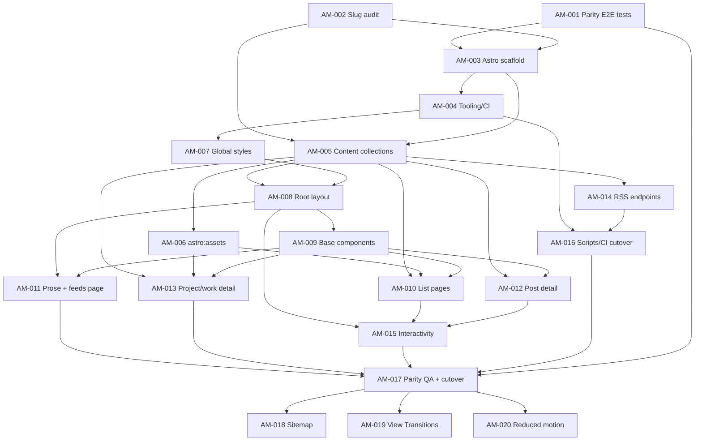

# Astro Migration - harambasic.de

Full rewrite of this SvelteKit 5 static site to **Astro**, staying as close to Astro idioms as possible: content collections, `astro:assets`, static endpoints, astro-icon, built-in Shiki. No Svelte remains afterward.

## Hard constraints

- **Everything works exactly as before**: all URLs, content, page structure, visual design, and all six RSS endpoints (`/rss`, `/feeds/rss`, `/posts/rss`, `/projects/rss`, `/work/rss`, `/uses/rss`) with their exact XML shape.
- **PostCSS stays** (postcss-nested, postcss-sorting, autoprefixer, cssnano, postcss-size). No Tailwind, no component library.
- **Icons stay visually identical**: Phosphor `ph:*` icons, now via `astro-icon` + `@iconify-json/ph` (build-time inline SVG, zero client JS).
- **Clean web standards**: semantic HTML, flat DOM (no div soup), native `<dialog>`/`<details>`, minimal vanilla JS, accessibility and performance at the core.
- All CLAUDE.md conventions carry over: functional programming only, CSS property ordering, colocated media queries, mandatory git hooks.

## Key decisions

1. **RSS: port the custom `generateXml`/`generateMergedXml` verbatim**, not `@astrojs/rss`. Exact output parity is a hard requirement; the quirky sorts (sections ASC, merged DESC), `content:encoded`, and `<category>` shape are already encoded in tested pure functions.
2. **Shiki `one-dark-pro`** replaces rehype-highlight + highlight.css. Astro-native, near-identical visuals to the current One Dark theme; code blocks stay always-dark.
3. **Slugs derive from the title** (`getSlug(title)`), never the filename - enforced in the entry accessor layer; AM-002 audits filename/title divergence up front so URLs and RSS `<guid>`s never change.
4. **TOC from Astro's native `render()` headings** + a pure nested-tree builder; the custom remark TOC plugin is retired.
5. **Vanilla JS only** for the four interactive behaviors (contact dialog via `#contact` hash, home-feed show more/less, clipboard copy, status filter if production actually renders it). Progressive enhancement: feed rows server-rendered with `hidden`.
6. **In-place rewrite on `feat/astro-migration`**: Astro replaces SvelteKit at the repo root; `src/content/` and `scripts/` survive nearly untouched; `static/` → `public/`, build output `build/` → `dist/`; `main` untouched until the final PR.
7. **Retired architecture**: `MarkdownProcessor`/`RemarkRehypeProcessor`/`TocPlugin`/`ImagePlugin`/`HtmlSanitizer`, `FileSystemContentService`, `entryConfigs`/`api.server` - Astro's content layer replaces them. Only the pure utility functions (and their tests) survive.
8. **Parity harness first** (Phase 0): Playwright snapshots + RSS fixtures captured from the *current* SvelteKit build become the acceptance bar for the final cutover.

## Phases & tickets

| Phase | Name | Tickets | Size |
|------:|------|---------|------|
| 0 | Parity harness | [AM-001](AM-001-parity-e2e-tests.md) E2E snapshots · [AM-002](AM-002-slug-parity-audit.md) Slug audit | M, S |
| 1 | Scaffold | [AM-003](AM-003-astro-scaffold.md) Astro scaffold · [AM-004](AM-004-tooling-postcss-lint-ci.md) Tooling/lint/CI | M, S |
| 2 | Content layer | [AM-005](AM-005-content-collections.md) Collections + utils · [AM-006](AM-006-images-astro-assets.md) astro:assets | L, S |
| 3 | Styles + layout | [AM-007](AM-007-global-styles.md) Global CSS · [AM-008](AM-008-root-layout-head-header-footer.md) Root layout/head/header/footer | S, M |
| 4 | Components | [AM-009](AM-009-base-components.md) Base components | M |
| 5 | List + static pages | [AM-010](AM-010-list-index-pages.md) Index pages · [AM-011](AM-011-static-prose-and-feeds-page.md) Prose + /feeds | M, S |
| 6 | Detail pages | [AM-012](AM-012-post-detail-pages.md) Post detail · [AM-013](AM-013-project-work-detail-pages.md) Project + work detail | M, M |
| 7 | Feeds + SEO | [AM-014](AM-014-rss-endpoints.md) RSS endpoints + `_headers` | M |
| 8 | Interactivity | [AM-015](AM-015-interactivity-home-page.md) Home page + modal + clipboard + filter | M |
| 9 | Tooling cutover | [AM-016](AM-016-scripts-ci-netlify-cutover.md) Scripts/CI/Netlify/docs | S |
| 10 | QA + cutover | [AM-017](AM-017-parity-qa-cutover.md) Full parity QA + merge | M |
| 11 | Post-parity enhancements | [AM-018](AM-018-sitemap.md) Sitemap · [AM-019](AM-019-view-transitions.md) View Transitions · [AM-020](AM-020-reduced-motion.md) Reduced motion | S, S, S |

Phases 0–10 are strict 1:1 parity. Phase 11 adds the user-approved Astro extras only **after** parity is locked in.

## Dependency graph



**Execution order (valid topological sort):**
AM-001 → AM-002 → AM-003 → AM-004 → AM-005 → AM-006 → AM-007 → AM-008 → AM-009 → AM-010 → AM-011 → AM-012 → AM-013 → AM-014 → AM-015 → AM-016 → AM-017 → (AM-018, AM-019, AM-020 in any order; AM-019 and AM-020 coordinate on motion handling)

## Risks & parity traps

- **Slug title-vs-filename mismatch** - slugs (and RSS guids) derive from titles, Astro ids from filenames. AM-002 gates this before any code is built.
- **Feed sort quirk** - section feeds sort published **ASC**, merged feed **DESC**. Looks like a bug; it's production behavior. Preserve.
- **`lastBuildDate`** changes every build - always stripped before fixture comparison.
- **Social image URLs** - `${DEPLOY_PRIME_URL || URL || 'https://harambasic.de'}/social/{getSlug(title)}.png`; env vars must reach `astro build` (Netlify sets them; CI passes them), and a PNG must exist per title.
- **Work positions** - `positions[].content` is markdown inside YAML; rendered at build via `renderPositionContent()` (remark → rehype → stringify), used by the work detail page and work RSS `content:encoded`.
- **Golden-ratio wrapper** - only on the three detail routes (`/posts/[slug]`, `/projects/[slug]`, `/work/[slug]`); `/feeds` gets no hero.
- **`#contact`** opens a dialog, not an anchor - SvelteKit needed `handleMissingId: 'ignore'`; Astro needs nothing, but the hash listener must run on every page.
- **Svelte vs Astro `:global()`** scoping semantics differ slightly - re-verify each `:global` usage (BaseCard image globals, BaseSegmentedButtons children).
- **Shiki vs hljs markup** - code-block internals intentionally differ; parity snapshots exclude them, everything else must match.
- **View transitions** (AM-019) require idempotent script re-init on `astro:page-load` and a manual GoatCounter count hook, or analytics under-report.
- **Dormant collections** - snippets (1 entry) and shareables (0) are defined but have no routes, exactly as today.
- **`image: TODO`** appears in real frontmatter - schemas must allow it; image helpers return null for it.

## Ticket format

Every ticket follows:

```markdown
# AM-0NN: Title
**Phase:** N - Name | **Size:** S/M/L | **Depends on:** AM-0XX, AM-0YY

## Goal
## Scope / Tasks
## Acceptance Criteria
## Notes / Parity traps
```

A ticket is done when all its acceptance criteria check off **and** the full quality gate (`bun run validate`) passes. Never bypass git hooks.
